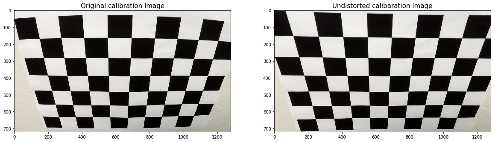
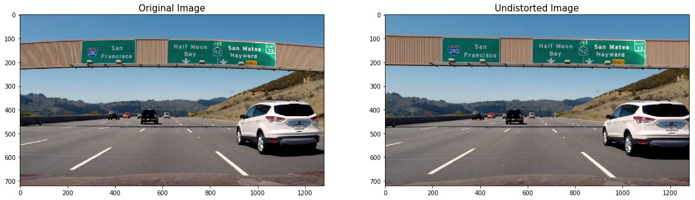
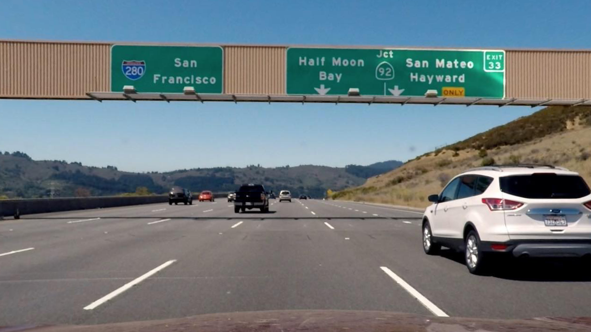
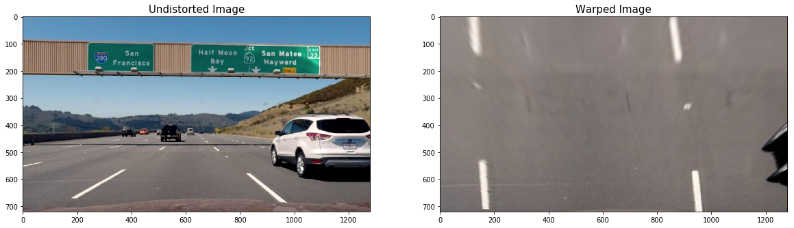

# Advanced Lane Finding Project

## Kemal Tepe, ketepe@gmail.common

### Objective: To find lanes more accurately by applying calibration, wraping and histogram based lane detection and unwraping to identify where the vehicle needs to follow.

### Summary: 

This project is enhanced version of the Project 1. The advancement is achieved by obtaining undistorted images by using camera calibaration parameters. Another enhancement is done by obtaining perspective transform of the lanes. With that, a birds eye view of the road is obtained. Birds eye image is processed by a pipepline of gradient, color filtering and thresholding methods. This pipeline returned an image which enabled us to identify lanes more accurately by obtaining some of the road features such as curvature of lanes, parallelizm, spacing between the lanes as well as polynomial fitting. With these features, the lanes are fairly easily and accurately identified. Then these lanes are projected back using reverse perpective onto the undistorted images and highlighted on the lane. Another feature was to use Line() class to keep important features of the process for sanity checking as well as bridge the features between the frames. This allowed us to have use the methods more accurately and reliably in more challenging scenarios such as in challenge video. The code presented in this folder successfully identify the lane in the project video. In the challenge video process has also identified lanes with some success. This can be further improved by using all the methods and parameters in the Line() class in the future.


### The goals / steps of this project are the following:

* Compute the camera calibration matrix and distortion coefficients given a set of chessboard images.
* Apply a distortion correction to raw images.
* Use color transforms, gradients, etc., to create a thresholded binary image.
* Apply a perspective transform to rectify binary image ("birds-eye view").
* Detect lane pixels and fit to find the lane boundary.
* Determine the curvature of the lane and vehicle position with respect to center.
* Warp the detected lane boundaries back onto the original image.
* Output visual display of the lane boundaries and numerical estimation of lane curvature and vehicle position.

### 1. Compute the camera calibration matrix and distortion coefficients given a set of chessboard images.
The code below is used to either calculate the calibration parameters or obtain the calibration parameters from pickle file. We do not need to run the calibration routine everytime since we assume we are using the same camera for all images and videos.

```python
def get_calibration_parameters():
    #get the camera calibration parameters
    #either from the file or from image processing 
    if (os.path.isfile('P4CameraParam.p'))==True:
        # read python dict back from the file
        print('Reading Camera Parameters from file')
        pickle_file = open('P4CameraParam.p', 'rb')
        p4dict = pickle.load(pickle_file)
        ret=p4dict['ret']
        mtx=p4dict['mtx']
        dist=p4dict['dist']
        rvecs=p4dict['rvecs']
        tvecs=p4dict['tvecs']
        nx=p4dict['nx']
        nx=p4dict['ny']
        pickle_file.close()
    else:
        print('Camera Param file not found!!')
        #number of corners in x and y directions
        nx=9
        ny=6
        #read the images
        cal_files='./camera_cal/calibration*.jpg'
        image_files=glob.glob(cal_files)
        #just to get image size
        dummy_img=cv2.imread('./camera_cal/calibration1.jpg')
        img_size=(dummy_img.shape[1], dummy_img.shape[0])
        #get the image and object points using utility function from ket_utilityP4
        imgpoints, objpoints=get_imagepoints_objpoints(image_files, gridsize=(nx, ny), debug_prt=0)
        ret, mtx, dist, rvecs, tvecs=cv2.calibrateCamera(objpoints, imgpoints,img_size, None, None)
        p4dict = {'ret': ret, 'mtx': mtx, 'dist': dist, 'rvecs': rvecs, 'tvecs': tvecs, 'nx': nx, 'ny': ny}
        output = open('P4CameraParam.p', 'wb')

        pickle.dump(p4dict, output)
        output.close()
    
    return mtx, dist
```

Below figure shows an checkerboard image before and after calibration:

 *one of the calibration images before and after calibration.* 


### 2. Apply a distortion correction to raw images.

After calibration parameters were obtained, the camera images can be processed using openCV function 
```
cv2.undistort(image, mtx, dist, None, mtx)
```
By using this the Road sign sample image is processed. The before and after images and a close up image is provided below.

 *Road sign image before and after calibration.* 

 *Close up of undistored Road sign image, notice the road signs are straight as opposed to curved in the original image.* 

### 3. Apply a perspective transform to rectify binary image ("birds-eye view").

The undistorted images are processed by using perspective transform to obtain birds-eye view of the road from the camera images.
OpenCV function is used to obtain the birds-eye images by using a transform matrix.

```
cv2.warpPerspective(undistorted_img, M, img_size, flags=cv2.INTER_LINEAR)
```

The transform matrix is obtained using the routine below with source and destination polygon. Finding right corners of the polygon was challenging since the undistorted image has a slight skew.

```Python
def get_M_Minv():
    #corner of the source
    left_bottom=[40,680]
    left_top=[490,482]
    right_top=[810,482]
    right_bottom=[1250,680]
    #source
    src=np.float32([left_top, right_top, right_bottom, left_bottom])
    #now destination
    #slight skew in the rectangle
    dst=np.float32([[0,0], [1280,0], [1250, 720],[40,720]])
    #perspective transportmation  
    M=cv2.getPerspectiveTransform(src, dst)
    Minv=cv2.getPerspectiveTransform(dst, src)
    
    return M, Minv 
```

Undistorted and wrapped images are shown below.

 *undistored Road sign image and its birds-eye view warped image.* 

### 4. Use color transforms, gradients, etc., to create a thresholded binary image.

Following pipeline was used to transform warped image to warped with only lanes binary image. In short, gaussian blurring is used to smooth the image, then sobel gradient filters were applied as well as S channel from HLS format. Finding right thresholds were critical but initial starting points obtained from the Udacity were pretty helpful.


```python

def pipeline(img):
    # Gaussian Blur
    kernel_size = 7
    img = cv2.GaussianBlur(img, (kernel_size, kernel_size), 0)
    # S channel 
    hls = cv2.cvtColor(img, cv2.COLOR_RGB2HLS)
    s = hls[:,:,2]
    # Grayscale image
    gray = cv2.cvtColor(img, cv2.COLOR_RGB2GRAY)
    # Sobel kernel size
    ksize = 7
    # Thresholding functions for each case
    gradx = abs_sobel_thresh(gray, orient='x', sobel_kernel=ksize, thresh=(10, 255))
    grady = abs_sobel_thresh(gray, orient='y', sobel_kernel=ksize, thresh=(60, 255))
    mag_binary = mag_thresh(gray, sobel_kernel=ksize, mag_thresh=(40, 255))
    dir_binary = dir_threshold(gray, sobel_kernel=ksize, thresh=(.65, 1.05))
    # Combine all the thresholded images
    combined = np.zeros_like(dir_binary)
    combined[((gradx == 1) & (grady == 1)) | ((mag_binary == 1) & (dir_binary == 1))] = 1
    # Threshold color channel
    s_binary = np.zeros_like(combined)
    s_binary[(s > 160) & (s < 255)] = 1
    # Stack each channel to view their individual contributions in green and blue respectively
    # This returns a stack of the two binary images, whose components you can see as different colors    
    color_binary = np.zeros_like(combined)
    color_binary[(s_binary > 0) | (combined > 0)] = 1
    
    return color_binary
    ```
    


### 5. Detect lane pixels and fit to find the lane boundary.

### 6. Determine the curvature of the lane and vehicle position with respect to center.

### 7. Warp the detected lane boundaries back onto the original image.

### 8. Output visual display of the lane boundaries and numerical estimation of lane curvature and vehicle position.

[//]: # (Image References)

[image1]: ./examples/undistort_output.png "Undistorted"
[image2]: ./test_images/test1.jpg "Road Transformed"
[image3]: ./examples/binary_combo_example.jpg "Binary Example"
[image4]: ./examples/warped_straight_lines.jpg "Warp Example"
[image5]: ./examples/color_fit_lines.jpg "Fit Visual"
[image6]: ./examples/example_output.jpg "Output"
[video1]: ./project_video.mp4 "Video"

## [Rubric](https://review.udacity.com/#!/rubrics/571/view) Points

### Here I will consider the rubric points individually and describe how I addressed each point in my implementation.  

---

### Writeup / README

#### 1. Provide a Writeup / README that includes all the rubric points and how you addressed each one.  You can submit your writeup as markdown or pdf.  [Here](https://github.com/udacity/CarND-Advanced-Lane-Lines/blob/master/writeup_template.md) is a template writeup for this project you can use as a guide and a starting point.  

You're reading it!

### Camera Calibration

#### 1. Briefly state how you computed the camera matrix and distortion coefficients. Provide an example of a distortion corrected calibration image.

The code for this step is contained in the first code cell of the IPython notebook located in "./examples/example.ipynb" (or in lines # through # of the file called `some_file.py`).  

I start by preparing "object points", which will be the (x, y, z) coordinates of the chessboard corners in the world. Here I am assuming the chessboard is fixed on the (x, y) plane at z=0, such that the object points are the same for each calibration image.  Thus, `objp` is just a replicated array of coordinates, and `objpoints` will be appended with a copy of it every time I successfully detect all chessboard corners in a test image.  `imgpoints` will be appended with the (x, y) pixel position of each of the corners in the image plane with each successful chessboard detection.  

I then used the output `objpoints` and `imgpoints` to compute the camera calibration and distortion coefficients using the `cv2.calibrateCamera()` function.  I applied this distortion correction to the test image using the `cv2.undistort()` function and obtained this result: 

![alt text][image1]

### Pipeline (single images)

#### 1. Provide an example of a distortion-corrected image.

To demonstrate this step, I will describe how I apply the distortion correction to one of the test images like this one:
![alt text][image2]

#### 2. Describe how (and identify where in your code) you used color transforms, gradients or other methods to create a thresholded binary image.  Provide an example of a binary image result.

I used a combination of color and gradient thresholds to generate a binary image (thresholding steps at lines # through # in `another_file.py`).  Here's an example of my output for this step.  (note: this is not actually from one of the test images)

![alt text][image3]

#### 3. Describe how (and identify where in your code) you performed a perspective transform and provide an example of a transformed image.

The code for my perspective transform includes a function called `warper()`, which appears in lines 1 through 8 in the file `example.py` (output_images/examples/example.py) (or, for example, in the 3rd code cell of the IPython notebook).  The `warper()` function takes as inputs an image (`img`), as well as source (`src`) and destination (`dst`) points.  I chose the hardcode the source and destination points in the following manner:

```python
src = np.float32(
    [[(img_size[0] / 2) - 55, img_size[1] / 2 + 100],
    [((img_size[0] / 6) - 10), img_size[1]],
    [(img_size[0] * 5 / 6) + 60, img_size[1]],
    [(img_size[0] / 2 + 55), img_size[1] / 2 + 100]])
dst = np.float32(
    [[(img_size[0] / 4), 0],
    [(img_size[0] / 4), img_size[1]],
    [(img_size[0] * 3 / 4), img_size[1]],
    [(img_size[0] * 3 / 4), 0]])
```

This resulted in the following source and destination points:

| Source        | Destination   | 
|:-------------:|:-------------:| 
| 585, 460      | 320, 0        | 
| 203, 720      | 320, 720      |
| 1127, 720     | 960, 720      |
| 695, 460      | 960, 0        |

I verified that my perspective transform was working as expected by drawing the `src` and `dst` points onto a test image and its warped counterpart to verify that the lines appear parallel in the warped image.

![alt text][image4]

#### 4. Describe how (and identify where in your code) you identified lane-line pixels and fit their positions with a polynomial?

Then I did some other stuff and fit my lane lines with a 2nd order polynomial kinda like this:

![alt text][image5]

#### 5. Describe how (and identify where in your code) you calculated the radius of curvature of the lane and the position of the vehicle with respect to center.

I did this in lines # through # in my code in `my_other_file.py`

#### 6. Provide an example image of your result plotted back down onto the road such that the lane area is identified clearly.

I implemented this step in lines # through # in my code in `yet_another_file.py` in the function `map_lane()`.  Here is an example of my result on a test image:

![alt text][image6]

---

### Pipeline (video)

#### 1. Provide a link to your final video output.  Your pipeline should perform reasonably well on the entire project video (wobbly lines are ok but no catastrophic failures that would cause the car to drive off the road!).

Here's a [link to my video result](./project_video.mp4)

---

### Discussion

#### 1. Briefly discuss any problems / issues you faced in your implementation of this project.  Where will your pipeline likely fail?  What could you do to make it more robust?

Here I'll talk about the approach I took, what techniques I used, what worked and why, where the pipeline might fail and how I might improve it if I were going to pursue this project further.  
