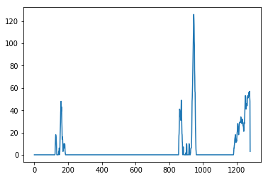

# Advanced Lane Finding Project

## Kemal Tepe, ketepe@gmail.common

### Objective: To find lanes more accurately by applying calibration, wraping and histogram based lane detection and unwraping to identify where the vehicle needs to follow.

### Summary: 

This project is enhanced version of the Project 1. The advancement is achieved by obtaining undistorted images by using camera calibaration parameters. Another enhancement is done by obtaining perspective transform of the lanes. With that, a birds eye view of the road is obtained. Birds eye image is processed by a pipepline of gradient, color filtering and thresholding methods. This pipeline returned an image which enabled us to identify lanes more accurately by obtaining some of the road features such as curvature of lanes, parallelizm, spacing between the lanes as well as polynomial fitting. With these features, the lanes are fairly easily and accurately identified. Then these lanes are projected back using reverse perpective onto the undistorted images and highlighted on the lane. Another feature was to use Line() class to keep important features of the process for sanity checking as well as bridge the features between the frames. This allowed us to have use the methods more accurately and reliably in more challenging scenarios such as in challenge video. The code presented in this folder successfully identify the lane in the project video. In the challenge video process has also identified lanes with some success. This can be further improved by using all the methods and parameters in the Line() class in the future.


### The goals / steps of this project are the following:

* Compute the camera calibration matrix and distortion coefficients given a set of chessboard images.
* Apply a distortion correction to raw images.
* Use color transforms, gradients, etc., to create a thresholded binary image.
* Apply a perspective transform to rectify binary image ("birds-eye view").
* Detect lane pixels and fit to find the lane boundary.
* Determine the curvature of the lane and vehicle position with respect to center.
* Warp the detected lane boundaries back onto the original image.
* Output visual display of the lane boundaries and numerical estimation of lane curvature and vehicle position.

### 1. Compute the camera calibration matrix and distortion coefficients given a set of chessboard images.
The code below is used to either calculate the calibration parameters or obtain the calibration parameters from pickle file. We do not need to run the calibration routine everytime since we assume we are using the same camera for all images and videos.

```python
def get_calibration_parameters():
    #get the camera calibration parameters
    #either from the file or from image processing 
    if (os.path.isfile('P4CameraParam.p'))==True:
        # read python dict back from the file
        print('Reading Camera Parameters from file')
        pickle_file = open('P4CameraParam.p', 'rb')
        p4dict = pickle.load(pickle_file)
        ret=p4dict['ret']
        mtx=p4dict['mtx']
        dist=p4dict['dist']
        rvecs=p4dict['rvecs']
        tvecs=p4dict['tvecs']
        nx=p4dict['nx']
        nx=p4dict['ny']
        pickle_file.close()
    else:
        print('Camera Param file not found!!')
        #number of corners in x and y directions
        nx=9
        ny=6
        #read the images
        cal_files='./camera_cal/calibration*.jpg'
        image_files=glob.glob(cal_files)
        #just to get image size
        dummy_img=cv2.imread('./camera_cal/calibration1.jpg')
        img_size=(dummy_img.shape[1], dummy_img.shape[0])
        #get the image and object points using utility function from ket_utilityP4
        imgpoints, objpoints=get_imagepoints_objpoints(image_files, gridsize=(nx, ny), debug_prt=0)
        ret, mtx, dist, rvecs, tvecs=cv2.calibrateCamera(objpoints, imgpoints,img_size, None, None)
        p4dict = {'ret': ret, 'mtx': mtx, 'dist': dist, 'rvecs': rvecs, 'tvecs': tvecs, 'nx': nx, 'ny': ny}
        output = open('P4CameraParam.p', 'wb')

        pickle.dump(p4dict, output)
        output.close()
    
    return mtx, dist
```


Below figure shows an checkerboard image before and after calibration:

 *one of the calibration images before and after calibration.* 


### 2. Apply a distortion correction to raw images.

After calibration parameters were obtained, the camera images can be processed using openCV function 
```
cv2.undistort(image, mtx, dist, None, mtx)
```
By using this the Road sign sample image is processed. The before and after images and a close up image is provided below.

 *Road sign image before and after calibration.* 

 *Close up of undistored Road sign image, notice the road signs are straight as opposed to curved in the original image.* 

### 3. Apply a perspective transform to rectify binary image ("birds-eye view").

The undistorted images are processed by using perspective transform to obtain birds-eye view of the road from the camera images.
OpenCV function is used to obtain the birds-eye images by using a transform matrix.

```
cv2.warpPerspective(undistorted_img, M, img_size, flags=cv2.INTER_LINEAR)
```

The transform matrix is obtained using the routine below with source and destination polygon. Finding right corners of the polygon was challenging since the undistorted image has a slight skew.

```Python
def get_M_Minv():
    #corner of the source
    left_bottom=[40,680]
    left_top=[490,482]
    right_top=[810,482]
    right_bottom=[1250,680]
    #source
    src=np.float32([left_top, right_top, right_bottom, left_bottom])
    #now destination
    #slight skew in the rectangle
    dst=np.float32([[0,0], [1280,0], [1250, 720],[40,720]])
    #perspective transportmation  
    M=cv2.getPerspectiveTransform(src, dst)
    Minv=cv2.getPerspectiveTransform(dst, src)
    
    return M, Minv 
```

Undistorted and wrapped images are shown below.

 *undistored Road sign image and its birds-eye view warped image.* 

### 4. Use color transforms, gradients, etc., to create a thresholded binary image.

Following pipeline was used to transform warped image to warped with only lanes binary image. In short, gaussian blurring is used to smooth the image, then sobel gradient filters were applied as well as S channel from HLS format. Finding right thresholds were critical but initial starting points obtained from the Udacity were pretty helpful.


```Python

def pipeline(img):
    # Gaussian Blur
    kernel_size = 7
    img = cv2.GaussianBlur(img, (kernel_size, kernel_size), 0)
    # S channel 
    hls = cv2.cvtColor(img, cv2.COLOR_RGB2HLS)
    s = hls[:,:,2]
    # Grayscale image
    gray = cv2.cvtColor(img, cv2.COLOR_RGB2GRAY)
    # Sobel kernel size
    ksize = 7
    # Thresholding functions for each case
    gradx = abs_sobel_thresh(gray, orient='x', sobel_kernel=ksize, thresh=(10, 255))
    grady = abs_sobel_thresh(gray, orient='y', sobel_kernel=ksize, thresh=(60, 255))
    mag_binary = mag_thresh(gray, sobel_kernel=ksize, mag_thresh=(40, 255))
    dir_binary = dir_threshold(gray, sobel_kernel=ksize, thresh=(.65, 1.05))
    # Combine all the thresholded images
    combined = np.zeros_like(dir_binary)
    combined[((gradx == 1) & (grady == 1)) | ((mag_binary == 1) & (dir_binary == 1))] = 1
    # Threshold color channel
    s_binary = np.zeros_like(combined)
    s_binary[(s > 160) & (s < 255)] = 1
    # Stack each channel to view their individual contributions in green and blue respectively
    # This returns a stack of the two binary images, whose components you can see as different colors    
    color_binary = np.zeros_like(combined)
    color_binary[(s_binary > 0) | (combined > 0)] = 1
    
    return color_binary

```

This pipeline yielded the following result from a warped image.

 *Warped input and pipelined binary output with lanes only.

### 5. Detect lane pixels and fit to find the lane boundary.

The binary warped image is inputted to ```def get_lines (binary_warped)``` function to obtain the lines using histogram and polynomial fitting. Code cell 8 in Jupyter Notebook provides the details of this processing.

 *Histogram of the warped binary image. The lane starting points in the image is clearly visible. 

From the base points the sliding windows based histogram is used to obtain the mid points and these points are fitted by 2nd degree polynomial. The resulting image with only fitted lines is given below.

 *Polynomially fitted lines.

### 6. Determine the curvature of the lane and vehicle position with respect to center.

Curvature and vehicle position on the lane was obtained using the following functions provided in the code. The curvature and offset (vehicle position with respect to the center) are displayed on the video outputs.

```def get_curvature(leftx, rightx, ploty)``` and ```def vehicle_lane_offset(left_fitx, right_fitx)```


### 7. Warp the detected lane boundaries back onto the original image.

Finally lanes identified from the warped image is projected back to unsitorted image using inverse transform matrix (Minv) using same corners for source and destination. The area between the accurately identified the lanes are highligted on the images as well as the offset and curvature information. 

The following function ```unwrap(undistorted_img, left_fitx, right_fitx, ploty, Minv)``` uses 

``` cv2.addWeighted(undistorted_img, 1, newwarp, 0.3, 0)``` and ```cv2.warpPerspective(color_warp, Minv, im_size)```  to put everything in place to be included in the output video file.


### 8. Output visual display of the lane boundaries and numerical estimation of lane curvature and vehicle position.

Following video file provides output of the code for the less challenging project video file.
[link to my video result](./P4_ket_output.mp4) 

The challenge video file was processed and the output is also provided below. This has a partial success. **I used lane_base checking and curvature checking mechanisms in my code. However, number of other techniques mentioned in the guideline should be implemented more accurate and robust lane detection in the challenge video.**

[link to my video result](./P4_ket_out_challenge.mp4) 


### Discussions

#### 1. Briefly discuss any problems / issues you faced in your implementation of this project.  

Number of problems were encountered during the project. Finding right perpective transform matrix was important for the successful warping and unwarping. The perpective transform was also important for lane detection process since uncorrect warping resulted erroneous histogram. 

The finding right mix in the pipeline from variety of options, sobels gradients, color challens, as well as their threshold values took some time to fine tune and obtain the right mix. 

Finally line fitting in the challenge video was difficult. That's why **Line()** class was utilized to overcome some challenges. 

Also, heuristic methods works at some level, a more systematic approach would need longer time to research and implement them.


#### 2. Where will your pipeline likely fail?  What could you do to make it more robust?

A robust lane detection algorihtm must utilize adaptive mechanisms, for example obtaining perspective transform matrix obtained from straigth lines and applying to curved lines is not the best way to have robust system. That is why some of the mechanisms mentioned in the imporvement section of the project guidelines, such as smoothing, lane base detection, look ahead filter etc. Given time, these will be implemented as a future work.

It was an another exciting project. I enjoyed however, finetuning, and finding right mix take time and effort to further enhance this project in the future.


